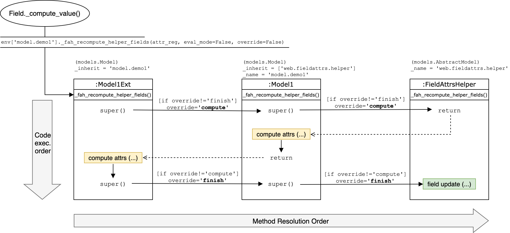

# Web Field Attrs Helper (FAH)

Questo modulo fornisce un abstract model che offre un nuovo modo di gestire l'attributo
``attrs`` dei campi e degli elementi nelle view XML.
Qualunque chiave dell'attributo ``attrs`` (``invisible``, ``readonly``, ``required`` e
``column_invisible``) di qualunque elemento XML presente sulle view, potrà essere gestito
direttamente da codice Python, avendo così accesso diretto all'environment di Odoo, in runtime.

È inoltre possibile gestire le operazioni di accesso ai record (CRUD), sempre con la
medesima modalità.

Con questo modulo potrai:
- Evitare di scrivere i domain nell'attributo ``attrs`` dei campi.
- Evitare di scivere *record rules*.

Questo modulo non si propone come una sostituzione dei normali metodi, ma come un'alternativa
utilizzabile solo nei contesti adatti.

Casi d'uso:
- Wizard.
- Form view molto dinamici e complessi.
- Sviluppo rapido.

In qualunque circostanza, per modelli con numero elevato di record si sconsiglia l'uso
di questo modulo a causa della riduzione delle prestazioni che potrebbe causare, se paragonato
con gli strumenti che abbiamo a disposizione di default.

NB: Le prestazioni dipendono in gran parte da come implementate la funzione che calcola gli
attributi e/o i permessi.


ATTENZIONE! Il prefisso ``web_`` nel nome del modulo farebbe pennsare ad un modulo che agisce solo
sul client. Tuttavia può modificare il comportamento dell'ORM anche al di fuori delle view.
Questo modulo è quindi a cavallo tra un modulo web e un modulo server.
Ho scelto di usare il prefisso ``web_`` perché se non si usa il modulo ``web``, questo modulo diventa
inutile, in quanto l'ORM offre già tutto quello di cui uno sviluppatore ha bisogno.


## Table of contents

- [Perché questo modulo?](#perche-questo-modulo)
- [Situazione attuale](#situazione-attuale)
  - [Uso delle *record rules*](#uso-delle-record-rules)
  - [Uso degli attributi "diretti" e lettura del context](#uso-degli-attributi-diretti-e-lettura-del-context)
  - [Uso tradizionale degli ``attrs``](#uso-tradizionale-degli-attrs)
  - [Uso degli ``attrs`` in combinazione con onchange o campo computed](#uso-degli-attrs-in-combinazione-con-onchange-o-campo-computed)
  - [Uso dell'argomento ``states``](#uso-dellargomento-states)
  - [Uso dell'argomento ``states`` in combinazione con onchange o campo computed](#uso-dellargomento-states-in-combinazione-con-onchange-o-campo-computed)
  - [Hack proposto da questo modulo](#hack-proposto-da-questo-modulo)
  - [Ricapitolando](#ricapitolando)
- [Panoramica del modulo ](#panoramica-del-modulo)
- [Abstract model](#abstract-model)
- [Trigger](#trigger)
- [Target: field, node](#target-field-node)
- [Modifiche al modello e alle sue view](#modifiche-al-modello-e-alle-sue-view)
  - [Aggiunta campi helper](#aggiunta-campi-helper)
  - [Iniezione degli ``attrs``](#iniezione-degli-attrs)
- [Tag helper](#tag-helper)
- [FahAttrRegistry *(attr_reg)*](#fahattrregistry-attr_reg)
- [super() e Method Resolution Order (MRO)](#super-e-method-resolution-order-mro)
  - [Implementazione errata](#implementazione-errata)
  - [Implementazione corretta](#implementazione-corretta)
- [Scrittura del metodo "compute" dei campi helper](#scrittura-del-metodo-compute-dei-campi-helper)
- [Funzione di controllo del rispetto delle regole sui target](#funzione-di-controllo-del-rispetto-delle-regole-sui-target)
- [Dichiarazione dei campi "force save" e "force null"](#dichiarazione-dei-campi-force-save-e-force-null)
- [Messaggio speciale ``_FAH_FORCE_COMMAND``](#messaggio-speciale-_fah_force_command)
- [Alternativa alle *record rules*](#alternativa-alle-record-rules)
  - [Campi helper per le ops](#campi-helper-per-le-ops)
- [Impostazioni di default e personalizzazioni](#impostazioni-di-default-e-personalizzazioni)
- [Gruppo e funzione di bypass](#gruppo-e-funzione-di-bypass)
- [Strumenti di debug per il backend](#strumenti-di-debug-per-il-backend)
- [Argomento ``eval_mode`` del metodo di computazione](#argomento-eval_mode-del-metodo-di-computazione)
- [Appendice](#appendice)
  - [Controindicazioni](#controindicazioni)
  - [Questioni etiche](#questioni-etiche)
  - [Alla comunità di Odoo](#alla-comunità-di-odoo)
  - [To-Do](#to-do)
  - [Decisioni da prendere e idee per svluppi futuri](#decisioni-da-prendere-e-idee-per-svluppi-futuri)
  - [Test da implementare](#test-da-implementare)

## Perché questo modulo?

Questo modulo è rivolto agli sviluppatori Odoo.

Odoo permette di definire le possibilità di interazione che l'utente ha con la view in vari
modi. Lo strumento principale sono gli ``attrs`` dei campi XML, definiti con dei *domain*.

Il domain è uno strumento statico, estremamente elegante e solido ma quando i campi sono
molti, purtroppo le regole da implementare possono diventare complesse e l'architettura
delle viste si fa di più difficile lettura.

Inoltre, il domain può solo "usare" informazioni presenti sulla view e, più precisamente,
solo i campi presenti sulla view. Purtroppo, a volte abbiamo necessità di prendere una
decisione sulla base di un dato che è accessibile solo tramite l'environment di Odoo.

Per affrontare queste situazioni di solito si implementa una soluzione ad-hoc per quella
specifica circostanza, ricorrendo spesso a soluzioni ibride tra domain, campi computed,
metodi onchange, record rules e override ai metodi dell'ORM.
Questo vuol dire che la logica che regola le view viene "sparsa" qua e là in modalità
sempre diverse, a seconda delle circostanze. Insomma, non c'è una procedura standard
per quando bisogna uscire dallo standard!

Con questo modulo si propone un metodo standard per affrontare queste situazioni estreme,
se proprio non si può fare altrimenti.


## Situazione attuale

Prima di vedere la soluzione proposta, può dunque essere utile ricapitolare i metodi
tradizionalmente usati per regolare e descrivere l'interazione che l'utente può avere con
i record e i loro campi.

Questa sezione serve per contestualizzare lo scopo e l'area di azione del presente modulo e
fornire una base teorica sulle tecniche di manipolazione delle view.
Se ciò non ti serve, puoi passare direttamente alla sezione 
["Panoramica del modulo"](#panoramica-del-modulo).

Queste prime sezioni sono nascoste di default perché utili solo a fini propedeutici.
Clicca per espandere:
<details>
<summary>Mostra/nascondi le sezioni propedeutiche.</summary>

### Uso delle *record rules*

Le *record rules* permettono di inibire le azioni di ``create``, ``write``, ``read`` e
``unlink`` su  sulla base del valore che uno o più campi assumono e, facoltativamente,
sulla base dei gruppi a cui l'utente appartiene.

Non hanno effetti sull'interattività degli elementi delle view, ma possono limitare appunto
l'apertura, il salvataggio, la creazione e la cancellazione dell'intero record.

```xml

    <record model="ir.rule" id="rule_archived_task_no_access">
      <field name="name">No access to archived tasks</field>
      <field name="model_id" ref="model_project_task"/>
      <field name="domain_force">[('active', '=', True)]</field>
      <field name="perm_read" eval="1"/>
      <field name="perm_write" eval="1"/>
      <field name="perm_create" eval="1"/>
      <field name="perm_unlink" eval="1"/>
    </record>
```

Con questa regola inibiamo a tutti gli utenti qualunque operazione sui record il cui campo
``active`` non è uguale a ``True``. Quindi tutti i record archiviati non saranno più
accessibili. Forse, un po' eccessivo... leggere magari ci serve!

> NB: I campi ``perm_read``, ``perm_write``, ``perm_create`` e ``perm_unlink`` sono impostati 
>     a ``True`` di default. Le *record rules* (globali) bloccano quindi qualunque operazione
>     di default. Noi dobbiamo specificare quali operazioni sono consentite.

Se vogliamo permetterne la lettura, ma non il resto, possamo fare così:

```xml

    <record model="ir.rule" id="rule_archived_task_readonly">
      <field name="name">Archived tasks are readonly</field>
      <field name="model_id" ref="model_project_task"/>
      <field name="domain_force">[('active', '=', True)]</field>
      <field name="perm_read" eval="0"/>
      <field name="perm_write" eval="1"/>
      <field name="perm_create" eval="1"/>
      <field name="perm_unlink" eval="1"/>
    </record>
```

Con questa regola, se il campo ``active`` non è uguale a ``True``, l'operazione ``read`` sul
record non sarà inibita, ma saranno inibite tutte le altre (``write``, ``create`` e
``unlink``). Questo per tutti gli utenti.

Questo primo tipo di regole sono dette "**global record rules**" in quanto non hanno il
campo ``groups`` impostato e quindi vengono applicate indipendentemente dai gruppi a cui
l'utente appartiene.

> :scream: ATTENZIONE: Ricordo che la nomenclatura dei permessi (``perm_read``, ``perm_write``,
> ``perm_create``, ``perm_unlink``) ha un significato completamente diverso da "ir.model.access".
> - In "ir.model.access" True/False hanno il significato di garantire o meno l'accesso ad una
>   determinata operazione CRUD. 
> - In "ir.rule" True/False indicano per quale operazione CRUD la regola deve essere applicata.

Se però vogliamo consentire agli utenti del gruppo ``my_module.group_admin`` di effettuare
tutte le operazioni, al posto della precedente regola, dobbiamo scrivere questo:

```xml
    
    <record model="ir.rule" id="rule_archived_task_readonly">
      <field name="name">Archived tasks are readonly</field>
      <field name="model_id" ref="model_project_task"/>
      <field name="domain_force">[('active', '=', True)]</field>
      <field name="groups" eval="[(4, ref('base.group_user'))]"/>
      <field name="perm_read" eval="0"/>
      <field name="perm_write" eval="1"/>
      <field name="perm_create" eval="1"/>
      <field name="perm_unlink" eval="1"/>
    </record>

    <record model="ir.rule" id="rule_archived_task_admin_full_access">
      <field name="name">Admin have full perms on tasks</field>
      <field name="model_id" ref="model_project_task"/>
      <field name="domain_force">[(1,'=',1)]</field>
      <field name="groups" eval="[(4,ref('my_module.group_admin'))]"/>
      <field name="perm_read" eval="1"/>
      <field name="perm_write" eval="1"/>
      <field name="perm_create" eval="1"/>
      <field name="perm_unlink" eval="1"/>
    </record>
```

Con queste due regole, se il campo ``active`` non è uguale a ``True`` e l'utente appartiene al
gruppo ``base.group_user``, saranno inibite tutte le operazioni tranne il ``read``.
Se invece l'utente appartiene al gruppo``my_module.group_admin``, non sarà inibita alcuna
operazione.

Questo secondo tipo di regole sono dette "**group record rules**" in quanto hanno il campo
``groups`` impostato e quindi vengono applicate solo agli utenti che appartengono ai gruppi
indicati.

> :scream: ATTENZIONE: Se non ci avete capito nulla, è normale. Sebbene le *group record rules*
> siano uno strumento molto potente, sicuro ed efficace, si combinano tra loro in modi
> complessi e la loro sintassi è estremamente controintuitiva e all'apparenza assurda.
> Per questo motivo è difficile spiegarne il funzionamento nel dettaglio, e soprattutto non
> è questa la sede.

> :warning: ATTEZIONE: Immaginiamo di impostare una *record rule* che consente solo il ``read``
> su un determinato modello. Se apriamo un record di quel modello tramite un campo relazionale
> in un form (di un'altro modello) quando siamo in modalità modifica, il form che si aprirà
> (in finestra/popup) sarà anch'esso modificabile. Anche se c'è la *record rule*! Ma proprio
> perché c'è la *record rule*, se l'utente modifica il form-popup, solo quando andrà a
> salvare il record principale sarà avvertito che non poteva modificare il record collegato.

Una cosa positiva è che possiamo usare campi in dot.notation nei domain, potendo così
reperire dati dai modelli collegati tramite campi Many2one.

Limitazioni di questo metodo:

- Anche se un record non ha il permesso write è comunque possibile, in certe circostanze,
  aprire un form in modalità modifica. Il record non potrà essere modificato, ma questo
  lo si scopre solo dopo (aver perso tempo!).
- Quando bisogna interagiscono tra di loro più regole può risultare difficile immaginare
  il comportamento finale e dunque la scrittura e il debug delle regole possono diventare
  estremamante complessi.
- Nessun accesso all'environment di Odoo.


### Uso degli attributi "diretti" e lettura del context

Odoo prevede che al momento di inviare una view al client, gli attributi ``invisible``,
``readonly`` e ``required`` degli elementi XML subiscano un ``safe_eval()`` nel cui scope
è anche presente il ``context``.
In questo modo, in una action view, possiamo decidere di inserire una chiave in modo che
venga letta da un'attributo.
Se la action view è definita in Python anziché in XML, possiamo avere accesso all'environment
di Odoo in runtime.

```xml

    <field name="field_name1" readonly="context.get('readonly_field_name1', 0)"/>
```

Oppure, nella definizione del campo, nel modello:

```python

    field_name1 = fields.Integer(readonly="context.get('readonly_field_name1', 0)")
```

La action che passa la chiave nel context:

```python

    def action_open_view(self):
        self.ensure_one()
        readonly_field = 0
        if self.env... == 'xyz': # <-- Accesso all'environment
            readonly_field = 1
        return {
            'type': 'ir.actions.act_window',
            'res_model': 'my.model',
            'res_id': self.id,
            'view_mode': 'form',
            'context': {'readonly_field_name1': readonly_field},
        }
```

In questo esempio, all'apertura del form, se nel ``context`` sarà presente la chiave
``readonly_field_name1`` e il suo valore sarà ``1``, il campo ``field_name1`` diventerà
readonly.

Con la linea ``if self.env... == 'xyz':`` si intende una decisione presa sulla base di un
dato presente nell'environment.

Limitazioni di questo metodo:
- Una volta caricata la view, non è più possibile, pur modificando il context, far
  rivalutare il ``context.get()`` presente come valore dell'attributo.


### Uso tradizionale degli ``attrs``

Normalmente Odoo prevede che gli ``attrs`` siano definiti staticamente tramite domain scritti
direttamente nella view XML. Ad esempio:

```xml

    <field name="field_name1" attrs="{'readonly': [('field_name2', '=', True)]}"/>
```

L'esempio qua sopra significa che, quando il campo ``field_name2`` assume valore ``True``,
il campo ``field_name1`` deve diventare ``readonly``.

Gli "attrs" sono: *invisible*, *readonly*, *required* e, per gli embedded tree, anche
*column_invisible*.

In questo modo "classico" tutta la logica della gestione degli elementi XML è scritta
direttamente nelle view e, per come è implementato attualmente il client JavaScript, non c'è
modo di accedere direttamente all'environment di Odoo per usare (nei domain) dati non presenti
nella view.

Limitazioni di questo metodo:
- Nessun accesso all'environment di Odoo; i domain possono puntare solo a campi presenti
  nella view.


### Uso degli ``attrs`` in combinazione con onchange o campo computed

Una soluzione attualmente disponibile per sfruttare informazioni dell'environment per 
gestire gli ``attrs`` dentro la vew è quella di scrivere i loro domain in modo che
puntino a campi computed o modificabili tramite metodi onchange.
A questo punto per gestire l'attributo di un elemento XML basta cambiare i valori dei
campi a cui punta il domain di questo "attr" sulla view.
Rifacendosi all'esempio precedente, si potrebbe fare così:

```python

    field_name2 = fields.Boolean(
        compute = '_compute_field_name2',
        store = False
    )

    field_name3 = fields.Char()

    @api.depends('field_name3')
    def _compute_field_name2()
        for r in self:
            if r.field_name3 == 'abc':
                if self.env... == 'xyz': # <-- Accesso all'environment
                    r.field_name2 = True
```

Con la linea ``if self.env... == 'xyz':`` si intende che possiamo variare il valore del campo
``field_name2`` tramite condizioni che valutano qualunque dato presente nell'environment di
Odoo; di conseguenza anche l'attributo ``readonly`` del campo ``field_name1`` dipenderà da
questa condizione.
Che si scelga di modificare manualmente il valore del campo ``field_name2`` o di calcolarlo
automaticamente, bisogna in ogni caso aggiungere manualmente il dominio negli ``attrs`` del
tag ``field`` XML, come mostrato sopra, nella sezione precedente.

Se lo scopo di questo campo calcolato è solo quello di attivare l'``attrs`` ``readonly`` di
uno o più specifici campi, possiamo chiamarlo "campo helper".

Se si volessero gestire tutti gli attributi con questo metodo, ci sarebbero alcune
controindicazioni:
- Bisogna creare un campo calcolato per ciascun attributo e per ciascun campo che si vuole
  gestire.

Questo vuol dire che per gestire i 3 attributi, per esempio per 10 campi, bisognerebbe creare
30 campi calcolati aggiutivi e scrivere altrettanti domain.


### Uso dell'argomento ``states``

Per definire gli ``attrs`` di un campo dal lato server, Odoo mette a disposizione anche
l'argomento ``states`` nella definizione dei campi del modello. Ad esempio:

```python

    state = fields.Selection(
        selection = [('value1', 'Value 1'), ('value2', 'Value 2')]
    )
    
    field_name1 = fields.Char(
        states = {'value1': [('readonly', False)]}
    )
```

L'esempio qua sopra significa che, quando il campo ``state`` assume il valore ``'value1'``,
il campo ``field_name1`` deve diventare ``readonly``.
Con l'argomento ``states`` è possibile dunque definire una logica del comportamento di ciascun
campo nelle view direttamente dal codice Python, ma le condizioni dipendono esclusivamente
dal valore che assume il campo ``state``.
In questo modo è **come se** Odoo inserisse questo ``attrs`` automaticamente:

```xml

    <field name="field_name1" attrs="{'readonly': [('state', '=', 'value1')]}"/>
```

Il lavoro che Odoo fa per noi è dunque quello di scrivere automaticamente i domini per gli
``attrs`` in modo che puntino al campo ``state``; quindi non dobbiamo più inserire manualmente
i domain negli ``attrs``, come nel primo esempio.

L'utilizzo dell'argomento ``states`` ha però una serie di limitazioni:
- Non c'è modo di utilizzare un altro campo all'infuori di ``state`` per definire le condizioni.
- Il nome campo ``state`` deve essere "sacrificato" a questa funzione.
- Non è possibile implementare ``states`` liberamente se estendiamo un modello che usa già il
  campo ``state`` per altri scopi.
- Si possono gestire solo elementi XML di tipo ``field``.
- Nessun accesso all'environment di Odoo, tutto dipende dal valore del campo ``state``.


### Uso dell'argomento ``states`` in combinazione con onchange o campo computed

È inoltre possibile unire le due soluzioni appena esposte calcolando il valore del campo
``state`` e di conseguenza gli ``attrs`` dei campi.
Rifacendosi al nostro esempio, è possibile usare un metodo ``@api.onchange`` o rendere
computed il campo ``state`` per modificarne dinamicamente il valore, e di conseguenza anche
l'attributo ``readonly`` del campo ``field_name1`` (sulla view).

```python

    state = fields.Selection(
        selection = [('value1', 'Value 1'), ('value2', 'Value 2')],
        compute = '_compute_state',
    )
    
    field_name1 = fields.Char(
        states = {'value1': [('readonly', False)]}
    )

    @api.depends('field_name3')
    def _compute_state()
        for r in self:
            if r.field_name3 == 'abc':
                if self.env... == 'xyz': # <-- Accesso all'environment
                    r.state = 'value1'
```

In questo modo è possibile definire il comportamento dei campi tramite Python (lato server) e
risparmiare la fatica di scrivere i domain degli ``attrs`` sulle view.
Ma restano comunque tutte le limitazioni esposte nella sezione precedente.

</details>


### Hack proposto da questo modulo

Prendiamo per esempio l'attributo ``readonly``.
Creaiamo un campo di tipo ``Char`` nel nostro modello. Ad esempio:
``fah_readonly_targets``

Andiamo nella definizione del tag ``field`` nella view XML e scriviamo questo domain negli
``attrs``:

```xml

    <field name="field_name1" attrs="{'readonly': [('fah_readonly_targets', 'like', 'field_name1')]}"/>
```
Questo significa che quando dentro al campo ``fah_readonly_targets`` appare la stringa
``'field_name1'``, il campo ``field_name1`` deve diventare ``readonly``.
Per evitare falsi positivi è meglio però delimitare il nome del campo con un carattere non
consentito nei nomi dei campi, per esempio ``@``.
L'esempio precedente diventerebbe:

```xml

    <field name="field_name1" attrs="{'readonly': [('fah_readonly_targets', 'like', '@field_name1@')]}"/>
```

A questo punto, se all'interno del campo ``fah_readonly_targets`` scriviamo
``'@field_name1@'``, il campo ``field_name1`` diventerà ``readonly``.

Ora, se impostiamo come computed il campo ``fah_readonly_targets`` possiamo decidere lato
server quando la stringa ``@field_name1@`` debba apparire.
Ad esempio:

```python

    fah_readonly_targets = fields.Char(
        compute = '_fah_compute_helper_fields',
        store = True,
    ))

    @api.depends('field_name2')
    def _fah_compute_helper_fields(self):
        for r in self:
            if r.field_name2 == True:
                r.fah_readonly_targets == '@field_name1@'
```

In questo modo, quando il campo ``field_name2`` diventa ``True``, nel campo
``fah_readonly_targets`` apparirà la stringa ``'@field_name1@'`` e il campo ``field_name1``
diventerà readonly.

Con lo stesso principio, scrivendo altri nomi di campi all'interno del campo
``fah_readonly_targets`` e aggiungendo i relativi domini negli ``attrs`` di quei campi,
diventa possibile gestire l'attributo ``readonly`` di più campi utilizzando un solo campo
"helper".

> In altre parole, dentro ``fah_readonly_targets`` c'è la lista di tutti i campi che devono
> diventare readonly.

Questo metodo è possibile applicarlo anche per gli altri attributi ``invisible``, ``required``
e ``column_invisible``.


### Ricapitolando

Prima di procedere è bene stabilire una convenzione terminologica da adottarsi da qui in avanti.
Prendendo i nomi dei campi dagli esempi fin'ora visti, abbiamo:
- ``field_name1``: campo **TARGET**
- ``field_name2``: campo **TRIGGER**
- ``fah_readonly_targets``: campo **HELPER**

I problemi principali ora sono:
- Creare un campo "helper" per ciascun attributo che vogliamo gestire.
- Creare un metodo per aggiungere e togliere i nomi dei campi target dai campi helper.
- Inserire tutti i domini negli attrs dei campi target che vogliamo gestire.

Il presente modulo offre una soluzione out-of-the-box per gestire tutto questo in modo
automatico e permettere allo sviluppatore di occuparsi solo di scrivere un metodo che
stabilisca quali campi devono assumere quale attributo.


## Panoramica del modulo

Questo modulo consiste in:
- Abstract model ``web.fieldattrs.helper``.
- Decoratore ``@api.fah_depends``.
- Classe ``FahAttrRegistry``.
- Estensione del metodo ``odoo.models.Model._fields_view_get()``.
- Estensione dei modelli ``ir.model`` e ``ir.ui.view``.

Per attivare le feature disponibli in questo modulo e cominciare ad usarle su un modello
nuovo o preesistente, sono necessarie le seguenti azioni:
1. Ereditare l'abstract model ``web.fieldattrs.helper``.
2. Dichiarare i campi trigger.
3. Dichiarare gli elementi (node) target.
4. Scrivere il metodo ``_fah_compute_helper_fields()``.

È poi possibile svolgere le seguenti azioni:
- Dichiarare i campi per i quali ignorare gli attr *readonly* o *invisible*.
- Dichiarare i campi per i quali ignorare l'attr *required*.
- Modificare le impostazioni di default per personalzzare il comportamento dell'helper.

Analizziamo ora in dettaglio cosa fa il modulo e le cose che deve fare lo sviluppatore per
utilizzarne le feature.


## Abstract model

Ereditiamo l'abstract model ``web.fieldattrs.helper``:

```python

from odoo import models

class MyModel(models.Model):
    _name = 'my.model'
    _inherit = ['web.fieldattrs.helper']
```

Proseguiamo poi con la dichiarazione dei campi trigger.


## Trigger

I trigger sono i campi che, quando vengono modificati, devono innescare la ri-computazione
degli attrs.

> NB: Attualmente i trigger possono essere solo campi del modello. Campi in dot.notation
>     non sono ammessi.

Anche i trigger vanno dichiarati nella definizione del modello, nell'apposito slot:
  
```python

    _fah_trigger_fields = { # set
        'field_name3',         # str
        'field_name4'
    }
```


## Target: field, node

Abbiamo detto che i ***target*** sono gli elementi XML di cui si possono gestire gli attrs.  
Possono essere di due tipi:

- FIELD: i tag ``<field>``.
- NODE: tutti gli altri elementi XML (es. ``<group>``, ``<button>``, ``<div>`` ecc.).

Per i **field** è possibile gestire tutti gli attrs:
- *readonly*
- *required*
- *invisible* (+ *column_invisible* nel caso di embedded tree)

Per i **node** invece hanno senso solo gli attributi di visibilità:
- invisible (+ *column_invisible* nel caso di embedded tree)

Per far sì che i domain vengano iniettati negli ``attrs`` dei target, questi vanno dichiarati
nella definizione del modello.

Dato che Odoo permette di creare "embedded view" all'interno dei from, è possibile dichiarare
anche gli elementi presenti in queste sotto-view. Tutte le embedded view sono associate ad
un campo relazionale di tipo One2many o Many2many. Il modello collegato è detto *comodel*.

Per questo motivo sono presenti 4 "slot" per la dichiarazione dei target:
- Field del modello: ``_fah_model_target_fields``
- Node del modello: ``_fah_model_target_nodes``
- Embedded field (comodels): ``_fah_embedded_target_fields``
- Embedded node (comodels): ``_fah_embedded_target_nodes``

<ins>**Campi del modello ed eventuale tag.**</ins>
Attributi gestibili: ``readonly``, ``required``, ``invisible``. 
```python

    _fah_model_target_fields = {  # set
        'field_a',                   # str
        ('field_b'),                 # tuple(str)
        ('field_c', '#DEMOTAG#')     # tuple(str, str)
    }
```

<ins>**Campi dei comodel collegati al modello in dot.notation ed eventuale tag.**</ins>  
Attributi gestibili: ``readonly``, ``required``, ``invisible``, ``column_invisible``.
```python

    _fah_embedded_target_fields = {          # set
        'item1_ids.item1_field',                # str
        ('item2_ids.item2_field'),              # tuple(str)
        ('item3_ids.item3_field', '#DEMOTAG#')  # tuple(str, str)
    }
```

> NB: I tag, per i campi sono facoltativi.

<ins>**Elementi generici nelle view del modello.**</ins>  
Set di tuple, ciascuna con 4 elementi: (tag, attribute, value, tag).  
Attributi gestibili: ``invisible``.
```python

    _fah_model_target_nodes = {                     # set
        ('group', 'name', 'group-1', '#DEMOTAG#')       # tuple(str,str,str,str)
        ('button', 'name', 'button-1', '#DEMOTAG#')
        ('div', 'id', 'section-1', '#FOO#')
    }
```

> Significa che quando il tag ``#DEMOTAG#`` apparirà nel campo helper ``fah_invisible_targets``,
> gli elementi ``<group name="group-1">`` e ``<button name="button-1">`` dovranno diventare
> invisibili.  

> Testato con tag: ``group``, ``div``, ``button``. Per i tag ``field`` usare gli appositi slot
> ``_fah_model_target_fields`` o ``_fah_embedded_target_fields``.  
> Testato con attributi: ``id``, ``name``.

<ins>**Elementi generici nelle view embedded (attualmente solo embedded tree).**</ins>  
Set di tuple, ciascuna con 5 elementi: (rel_field, HTML tag, attribute, value, tag helper).  
Attributi gestibili: ``invisible``, ``column_invisible``.
```python

    _fah_embedded_target_nodes = {                                     # set
        ('item_ids', 'button', 'name', 'action_demo', '#HIDE-BUTTON#')    # tuple(str,str,str,str,str)
    }
```
> NB: I tag, per i node sono obbligatori. Questo perché, a differenza dei campi che sono
>     facilmente individuabili tramite il loro nome, gli altri elementi XML devono essere
>     definiti dalla combinazione di *tag*, *attributo* e *valore*, fatto che complica la scrittura
>     e rende poco intuitiva la funzione dell'elemento che si vuole dichiarare e poi gestire.
>     I tag aggiungono un po' di semantica, che non guasta mai.


## Modifiche al modello e alle sue view

A questo punto del setup, se avviamo Odoo e aggiorninamo il modulo del nostro modello, potremo
vedere che sono già cambiate un po' di cose.


### Aggiunta campi helper
Di default, in un modello che eredita l'abstract model ``web.fieldattrs.helper`` vengono
creati automaticamente 4 campi computed di tipo Char, i "campi helper":

- ``fah_readonly_targets``
- ``fah_required_targets``
- ``fah_invisible_targets``
- ``fah_column_invisible_targets``

> NB: Il prefisso ``fah_`` è personalizzabile in ciascun modello, per evitare eventuali
  collisioni.

Tutti questi campi helper saranno iniettati automaticamente in tutte le view del modello.
I campi helper sono di default *invisible* e *readonly*.
Per renderli visibili si può attivare la modalità debug come illustrato nella sezione
[Impostazioni di default e personalizzazioni](#impostazioni-di-default-e-personalizzazioni).


### Iniezione degli ``attrs``
Nei target, che sono elementi XML di cui vogliamo gestire gli attributi,
sarà invece iniettato automaticamente un attributo ``attrs`` le cui chiavi (readonly, required
ecc...) avranno un domain che punterà al relativo campo helper. 

```xml

    <field name="field_name1"
           attrs="{
               'readonly': [('fah_readonly_targets', 'like', '@field_name1@')],
               'required': [('fah_required_targets', 'like', '@field_name1@')],
               'invisible': [('fah_invisible_targets', 'like', '@field_name1@')]
           }"/>
```

Per i campi di un embedded tree, abbiamo anche l'attributo ``column_invisible``.
Per esempio, se il nostro campo è visualizzato tramite un campo One2many che chiamiamo
``item_ids``, potremmo avere:

```xml

    <field name="item_ids">
      <tree>
        <field name="field_name1"
               attrs="{
                   'readonly': [('parent.fah_readonly_targets', 'like', '@item_ids.field_name1@')],
                   'required': [('parent.fah_required_targets', 'like', '@item_ids.field_name1@')],
                   'invisible': [('parent.fah_invisible_targets', 'like', '@item_ids.field_name1@')],
                   'column_invisible': [('parent.fah_column_invisible_targets', 'like', '@item_ids.field_name1@')]
               }"/>
      </tree>
    </field>

```

Se anche il comodel che passa per ``item_ids`` implementa questo helper, allora saranno iniettati
anche i domain verso i campi helper del comodel.

```xml

    <field name="item_ids">
      <tree>
        <field name="field_name1"
               attrs="{
                   'readonly': [
                     '|',
                        ('fah_readonly_targets', 'like', '@field_name1@'),
                        ('parent.fah_readonly_targets', 'like', '@item_ids.field_name1@')
                   ],
                   'required': [
                     '|',
                        ('fah_required_targets', 'like', '@field_name1@'),
                        ('parent.fah_required_targets', 'like', '@item_ids.field_name1@')
                   ],
                   'invisible': [
                     '|',
                        ('fah_invisible_targets', 'like', '@field_name1@'),
                        ('parent.fah_invisible_targets', 'like', '@item_ids.field_name1@')
                   ],
                   'column_invisible': [('parent.fah_column_invisible_targets', 'like', '@item_ids.field_name1@')]
               }"/>
      </tree>
    </field>

```

Come abbiamo detto, tutto questo è gestito automaticamente.

> :warning: NB: Se nella view un campo target contiene già degli ``attrs``, di default viene sollevato
> un messaggio di errore.
> Per bypassare il blocco e sovrascrivere gli attrs, basta impostare l'attributo
> ``_FAH_XML_INJECT_SAFE`` del modello su ``False``. Attualmente non è possibile effettuare un
> merge con i domain degli attrs già preesistenti.

> NB: Attualmente tutti i domini iniettati sono composti da operandi concatenati da operatori
>     ``'|'`` (or).


Da Odoo v13 in avanti c'è un meccanismo che inietta un domain domain automaticamente nei campi
relazionali quando è attiva la feature che controlla la company-cosistency. Non sono ancora stati
fatti test in questo senso in quanto il modulo è appena stato migrato dalla versione 12.0. 

> :warning: Non sono ancora stati fatti test utilizzando la funzione ``_check_company_auto``.

Vediamo ora il concetto di tag helper e come usarlo nella dichiarazione degli elementi XML.


## Tag helper

Nel momento in cui andremo a impostare un attributo, dovremo indicare qual'è il nostro target.
Se il target è un field, ci può bastare indicare direttamente il nome del campo.
Ma nel caso di un node è più facile e intuitivo assegnare all'elemento un tag e richiamare
questo quando si vuole gestire l'attributo dell'elemento.

Questo approccio offre un vantaggio ulteriore: assegnando il medesimo tag a più elementi,
quando andremo ad agire su un attributo richiamando quel tag, tutti gli elementi taggati
assumeranno quell'attributo.  

Dato questo vantaggio, è possibile taggare anche i campi, operando così col medesimo approccio.

> Immaginiamo di avere una serie di campi che devono tutti essere nascosti quando una stessa
> condizione si verifica. Se tagghiamo tutti i campi col medesimo tag, ad esempio "#FOO#",
> ci basterà il comando ``attr_reg.set(['#FOO#'], 'invisible', True, r)`` per nascondere tutti
> i campi contemporaneamente.

Infine, un elemento può assumere più tag. Per fare questo basta ripetere la dichiarazione
dell'elemento e indicare il nuovo tag.

```python

    _fah_model_target_fields = {    # set
        ('field_c', '#DEMOTAG#')       # tuple(str,str)
        ('field_c', '#FOO#')
        ('field_c', '#BAR#')
    }
```

È possibile indicare un solo tag per ciascuna dichiarazione.

Di default tag devono essere delimitati dal carattere ``#`` per evitare omonimie con i campi.
È possibile personalizzare questa funzione a livello di modello, per fare ciò si rimanda
alla sezione [Impostazioni di default e personalizzazioni](#impostazioni-di-default-e-personalizzazioni).


## FahAttrRegistry *(attr_reg)*

Per tenere traccia di tutti gli attributi che ciascun campo target, su ciascun record, deve
assumere, è stato predisposto un registro che possiamo chiamare "Attribute Registry", o più
comodamente ``attr_reg``.
Sono l'abstract model e il decoratore ``@api.fah_depends()`` che si ocupanoo di creare il
registro, quindi lo sviluppatore può limitarsi ad impostare solo gli attributi.

> Nota: È possibile creare un nuovo ``attr_reg`` a partire dalla classe ``FahAttrRegistry``,
>       situata in ``odoo.addons.web_fieldattrs_helper.attr_registry.FahAttrRegistry``.

Ciascuna istanza di FahAttrRegistry possiede i metodi ``set()`` e ``get()`` per scrivere
e leggere sul registro.

```python

    FahAttrRegistry.set(target_names, attr, value, record, msg=False)
    """ Set a boolean value to an attr on specific target names of a record.
    :param list target_names:  list of strings containing the names of the targets (fields or tags)
    :param str attr:           the attribute; available values are the attrs ('readonly', 'required', 'invisible', 'column_invisible')
                               or the ops ('no_read', 'no_write', 'no_create', 'no_unlink')
    :param bool value:         the value to be set
    :param record:             the record (must be a record of the model that created the registry object)
    :param str msg:            optional message for the user, if this rule is supposed to raise an error during write, create or unlink.
    """ 

    FahAttrRegistry.get(target_name, attr, record)
    """ Get the current value of an attr of a specific target name and record.
    :param str target_name:  the name of a field or tag
    :param str attr:         the attribute; available values are the attrs ('readonly', 'required', 'invisible', 'column_invisible')
                             or the ops ('no_read', 'no_write', 'no_create', 'no_unlink')
    :param record:           the record (must be a record of the model that created the registry object)
    :return:                 dict containing the keys 'val' (bool) and 'msg' (str)
    :rtype:                  dict
    """
```

Un'istanza di FahAttrRegistry serve quindi da contenitore per passare le informazioni tra
i vari metodi nella catena MRO tramite il comando ``super()``.


## super() e Method Resolution Order (MRO)

Per impostare gli attrs di un campo quando un trigger viene modificato, bisogna fare
l'override del metodo ``_fah_compute_helper_fields()`` (che è presente nell'abstract model).

Normalmente basta mettere un solo ``super()`` in una certa posizione per decidere esattamente
in quale sequenza vada eseguito il codice all'interno dei vari metodi della catena MRO.
In particolare, per i metodi che scrivono nei campi computed è previsto che ciascun metodo
in override scriva direttamente nei campi quello che gli serve. Così facendo, diventa
necessario inserire il ``super()`` all'inizio del metodo, prima delle scritture, in modo che
il "nuovo" codice venga eseguito dopo quello "vecchio". Se facessimo al contrario, il codice
vecchio potrebbe sovrascrivere i nuovi dati.

Durante l'override del metodo ``_fah_compute_helper_fields()``, è invece previsto che si
interagisca solo con l'oggetto FahAttrRegistry, e non si scriva nulla nei campi helper.
Sarà l'ultimo metodo nell'MRO, quello nell'abstract model, ad effettuare la scrittura sui
campi helper.

Questo modo di implementare i metodi dei campi computed complica però un po' le cose.


### Implementazione errata

Se si potesse prevedere con certezza che il nostro modello non verrà mai esteso, si potrebbe
fare l'override in questo modo:
```python

    @api.fah_depends(*_fah_trigger_fields)
    def _fah_compute_helper_fields(self, attr_reg, eval_mode=False):
        
        for r in self:
            ...        #  <-- Qua ci vanno le regole

        super()._fah_compute_helper_fields(attr_reg, eval_mode=eval_mode)
```

Scriveremmo le nostre regole e poi con ``super()`` eseguiremmo il metodo nell'abstract model,
il quale scriverebbe nei campi helper.

Ma dato che Odoo e Python si fondano sulla estendibilità, siamo costretti a scrivere il
nostro modulo prevedendo che esso possa venire esteso.


### Implementazione corretta

Il nostro caso è un po' più complicato e la soluzione attuale prevede l'uso di una doppia
chiamata ``super()``, una all'inizio e una alla fine.

```python

    @api.fah_depends(*_fah_trigger_fields)
    def _fah_compute_helper_fields(self, attr_reg, eval_mode=False, override=False):
        
        if override != 'finish': # -> in [False, 'compute']
            super()._fah_compute_helper_fields(attr_reg, eval_mode=eval_mode, override='compute')
            for r in self:
                ...        #  <-- Qua ci vanno le regole

        if override != 'compute': # -> in [False, 'finish']
            super()._fah_compute_helper_fields(attr_reg, eval_mode=eval_mode, override='finish')
```

In pratica dobbiamo eseguire i calcoli degli attrs in ordine inverso rispetto all'MRO,
passando l'argomento "attr_reg" da un metodo all'altro e infine ritornare all'ultimo metodo
per scrivere sui campi.

Il seguente diagramma rappresenta come dovrebbe procedere la call stack a partire da quando
il metodo ``Field._compute_value()`` avvia il primo metodo nell'MRO, fino a quando l'ultimo
metodo aggiorna i campi helper calcolati.



Per evitare di scrivere sui campi calcolati la prima volta che si risale la catena MRO,
si usa l'argomento ``override`` che, se assume il valore ``'compute'``, blocca la scrittura
sull'ultimo metodo che dunque termina l'esecuzione. A questo punto, in ordine inverso vengono
calcolati gli attributi, fino a risalire al primo metodo il quale, dopo aver calcolato per
ultimo gli attributi, può inviare il segnale di scrittura con un nuovo ``super()``, questa
volta con l'attributo ``override`` impostato su ``'finish'``. Ciascun metodo ora non farà
altro che passare il registro al metodo successivo. Quando si raggiunge nuovamente l'ultimo
metodo, questo potrà procedere finalmente alla scrittura dei campi computed.

> :interrobang: Per evitare di dover ripetere queste due condizioni e i relativi ``super()``
> tutte le volte che si fa l'override, si potrebbe trasferire questa parte di codice dentro
> il decoratore ``@api.fah_depends`` ma, a quanto pare, chiamare super() all'interno di un
> decoratore è alquanto complicato. Per ora non mi sono ancora addentrato in questo problema.
> Partendo da [questa discussione](https://mail.python.org/pipermail/python-ideas/2017-January/044498.html),
> ho trovato queste idee:
> - Uso del "*descriptor protocol*": https://gist.github.com/1st1/ebee935256c7cc35c38cc3f73f00461d
> - https://github.com/refi64/mirasu


## Scrittura del metodo "compute" dei campi helper

Spiegato come dovrebbe essere la struttura del metodo ``_fah_compute_helper_fields()``,
vediamo come impostare gli attributi dei campi.

Esempio di utilizzo del metodo negli override:
```python

    @api.fah_depends(*_fah_trigger_fields)
    def _fah_compute_helper_fields(self, attr_reg, eval_mode=False, override=False):

        if override != 'finish': # -> in [False, 'compute']
            super()._fah_compute_helper_fields(attr_reg, eval_mode=eval_mode, override='compute')
            for r in self:
                
                # Per 'readonly', 'required', 'invisible'
                # (campi del modello)
                if ... :
                    attr_reg.set(['field_name'], 'readonly', True, r,
                        msg='You cannot edit the field because...')
                
                # Per 'column_invisible', 'readonly', 'required', 'invisible' 
                # (campi del comodel negli embedded tree )
                if ... :
                    attr_reg.set(['items_ids.item_field'], 'column_invisible', True, r)
                
                # Per 'invisible' TAG
                if ... :
                    attr_reg.set(['#DEMOTAG#'], 'invisible', True, r)

        if override != 'compute': # -> in [False, 'finish']
            super()._fah_compute_helper_fields(attr_reg, eval_mode=eval_mode, override='finish')
```

> :warning: CONSIDERA CHE:
> - Le regole nuove sovrascrivono quelle vecchie.
> - Il messaggio (facoltativo) lo si può indicare solo se il valore è ``True``.
> - L'ultimo messaggio per un target/attributo sovrascrive il precedente.

``@api.fah_depends()`` è un decoratore scritto ad-hoc. Incorpora il normale ``@api.depends()``
al suo interno, ma svolge anche altre operazioni utili in questo caso, come per esempio
creare un nuovo attr_reg se questo non viene passato come argomento.

I parametri, tutti opzionali, sono:
```python
    FieldAttrsHelper._fah_compute_helper_fields(attr_reg=False, eval_mode=False, override=False)
        """
        :param FahAttrRegistry attr_reg:  Attributes registry. If False, a new empty one will be created.
        :param bool eval_mode:            Whether it is necessary to write on the fields or not.
        :param str override:              Command to handle calls between methods in the MRO chain.
                                          The first external call to the overrided method on real models
                                          must ignore this argument (override==False). It should be for
                                          internal use only. 
        :return:  False
        """
```

Normalmente lo sviluppatore non dovrebbe aver bisogno di chiamare questo metodo direttamente.
Essa è usata da ``Field._compute_value()`` quando viene innescata la ricomputazione dei
campi; e dai metodi ``write()``, ``create()``, ``read()`` e ``unlink()`` quando devono
verificare che gli attrs e le ops siano rispettate. In questo secondo caso, i campi non
vengono scritti ma viene compilato solo l'attr_reg.


## Funzione di controllo del rispetto delle regole sui target

Di default questo modulo verifica durante il ``write()`` e il ``create()`` che le
informazioni inserite dall'utente rispettino quanto previsto dagli ``attrs`` dei campi.
Se su di un record viene alterato un campo che è previsto debba essere *readonly* e/o
*invisible*, durante la scrittura sarà sollevato un errore.

Controlli effettuati:
- ``readonly`` e ``invisible``: Il valore del campo non può essere modificato.
- ``required``: Il campo non può essere lasciato "vuoto".

Ciascun modello controlla i propri campi. Non è possibile controllare i campi sulle viste
embedded, i quali appartengono ai rispettivi comodel. Se serve svolgere questi controlli
ma il comodel non implementa questo helper, bisogna ricorrere al tradizionale
``@api.constrains()`` oppure effettuare l'override di ``create()`` e ``write()`` sul comodel.

È possibile disattivare questa funzione a livello di modello, per fare ciò si rimanda
alla sezione [Impostazioni di default e personalizzazioni](#impostazioni-di-default-e-personalizzazioni).

Se invece si preferisce forzare la scrittura di un determinato campo, indipendentemente dal
suo attributo nelle view, è possibile dichiarare il campo negli appositi slot per i campi
"force save" e "force null". Vedi sezione successiva.

Se le opzioni di check durante il ``write()`` e/o ``create()`` sono disattivate sarà solo
il client a validare i campi e controllare che gli ``attrs`` siano rispettati.

> NB: il controllo sull'attr ``required`` verifica che il valore delcampo non sia vuoto/nullo.
> Ciò che è considerato "valore nullo" varia a seconda del tipo di campo. Da cosiderare con
> attenzione è soprattutto il caso dei campi di tipo ``Integer``, ``Float`` e ``Monetary``,
> che sono considerati nulli sia se il loro valore è ``0`` (zero), sia se è ``False``.
> Consideriamo inoltre che i widget sulle view possono modificare il valore dei campi prima
> di inviarli al server.


## Dichiarazione dei campi "force save" e "force null"

Se le funzioni di controllo durante il ``write()`` e/o ``create()`` sono attive, potrebbe
però essere necessario ignorare questi controlli solo per qualche specifico campo.

Per fare questo ci sono due specifici slot: uno per permettere la modifica anche se
l'attributo è ``readonly`` e/o ``invisible`` e un altro per consentire il valore "vuoto"
se l'attributo è ``required``.

I campi che possono essere modificati indipendentemente dal fatto che siano ``readonly``
e/o ``invisible`` sulle view devono essere dichiarati qua:

```python

    _fah_force_save_fields = { # set
        'field_name2',            # str
    }
```

I campi che possono essere lasciati "vuoti" indipendentemente dal fatto che siano
``required`` sulle view devono essere dichiarati qua:

```python

    _fah_force_null_fields = { # set
        'field_name20',            # str
    }
```

Su questi campi sarà solo il client a validarne il contenuto e controllare che gli ``attrs`` siano
rispettati.

Dato che possono essere verificati solo i campi appartenenti al modello, qua i campi in
dot.notation non sono ammessi.

## Messaggio speciale ``_FAH_FORCE_COMMAND``

Se le funzioni di controllo durante il ``write()`` e/o ``create()`` sono attive, potrebbe
essere necessario ignorare questi controlli solo in qualche specifica situazione,
e solo su qualche specifico campo.

Se inserissimo un campo negli slot ``_fah_force_save_fields`` e/o ``_fah_force_null_fields``,
i controlli per quel campo sarebbero ignorati sempre.  Non è quello che vogliamo.

Se si ha quindi la necessità che i controlli non dovranno essere fatti per una specifica
regola, quando impostiamo l'attributo con il comando ``FahAttrRegistry.set()``, possamo
inviare il messaggio speciale ``'no-check'``.

Per fare ciò basta inserire come argomento ``msg`` la parola chiave indicata
nell'attributo/parametro ``_FAH_FORCE_COMMAND`` del modello, che di default è ``'no-check'``.

```python

  attr_reg.set(['field_name'], 'readonly', True, r,
      msg='no-check')
```

Questo esempio significa che se il campo ``field_name`` viene modificato, anche se sulla
view esso è readonly, ne sarà consentita la scrittura.

Anche in questo caso sarà solo il client a validare il contenuto e controllare che
gli ``attrs`` siano rispettati.

## Alternativa alle *record rules*

Quanto abbiamo visto fino ad ora re-implementa l'utilizzo degli ``attrs`` dei campi sulle
view. Gli attrs regolano l'interazione che l'utente può avere con i campi.

Le *record rules* invece regolano l'interazione che l'utente può avere con l'intero record
(come abbiamo visto nelle sezioni propedeutiche).

Ho pensato quindi di aggiungere degli attributi extra per poter scrivere delle regole che
possano inibire i metodi di ``create()`` ``write()`` ``read()`` ``unlink()`` nello stesso
modo che si fa con gli attrs.

Per distinguerli dagli "attrs", chiamiamo questi attributi "**OPS**".

Le **ops** sono:
- ``no_read``: Impedisce la lettura del record.
- ``no_write``: Impedisce la scrittura sul record.
- ``no_create``: Impedisce la creazione di un nuovo record.
- ``no_unlink``: Impedisce l'eliminazione del record.


A differenza degli *attrs* che si riferiscono ai **campi** di un determinato record,
le *ops* si riferiscono al **record** stesso.

```python

  attr_reg.set(0, 'no_unlink', True, r,
      msg='You cannot delete the record because...')
```

> NB: Se il comando passato con il secondo argomento è una ops, primo argomento diventa
> ininfluente e sarà ignorato; quindi possiamo scrivere un semplice "zero".

Come per le *record rules*, le regole non si applicano se l'operazione viene eseguita
in "superuser-mode" (controllo fatto con ``is_superuser()``).

### Campi helper per le ops

Non è previsto che le ops abbiano conseguenze dirette sull'interattività della view,
dunque non dovrebbero servire dei campi helper dedicati. Lo stato delle ops è presente
nell'``FahAttrRegistry`` (attr_reg) e viene letto direttamente da lì durante i controlli.

Potrebbe però essere utile mostrare qualcosa sulla view quando il record assume un certo
ops, per esempio un simbolo o un avviso.

Attualmente, l'opzione ``_FAH_CREATE_OPS_FIELDS`` (di default impostata su ``False``)
permette di creare 4 campi helper boolean per rappresentare lo stato di ciascuna ops
più altri 4 campi char che contengono il relativo ed eventuale messaggio da mostrare
all'utente (attributo ``msg`` del metodo ``FahAttrRegistry.set()``).

I campi helper degli ops possono quindi anche servire a gestire gli attrs di elementi XML.
Per esempio: se il record non può essere eliminato, vogliamo che appaia il simbolo di un
lucchetto chiuso in alto a destra di un form.
Attualmente possiamo farlo "manualmente", mettendo la nostra icona tra i target e
ricordandoci di renderla visibile o meno ogni volta che impostiamo ``no_unlink``.

Oppure vogliamo che tutti i campi target siano ``readonly`` se ``no_write`` è ``True``.

> :bulb: Per ciascun campo helper ops (boolean) si potrebbe creare un id univoco da
> assegnare agli elementi XML che vogliamo vengano resi visibili quando quella ops diventa
> True sul quel record. In questo modo possiamo iniettare automaticamente dentro questi
> elementi il dominio che punta a al campo helper ops.


## Gruppo e funzione di bypass

Dato che è possibile dichiarare un campo sia come trigger che come target, diventa
teoricamente possibile creare una ricorsione che blocca un campo e non permetta più che
questo venga modificiato. In questo caso è possibile disattivare le funzionalità
dell'helper solo per uno specifico record, in runtime, senza bisogno di riavviare il server.

Gli utenti che appartengono al gruppo ``web_fieldattrs_helper.fah_global_bypass_group``,
quando attivano la "developer mode", troverano in fondo a ciascun form, il campo
``fah_bypass``. Impostando il valore su ``True``, la computazione degli attributi sarà
disattivata su quel record.

In tal modo è possibile "sbloccare" una situazione imprevista, in caso di emergenza.

È poi possibile ripristinare il normale funzionamento di quel record, riportando a ``False``
il medesimo campo.

:warning: ATTENZIONE: Questa è da considerarsi solo una soluzione di emergenza, in quanto queste
situazioni, di norma NON DEVONO ACCADERE. Quando ciò accade, solitamente si tratta di
un errore di sviluppo, che dovrà essere corretto il prima possibile per evitare che il
problema si riproponga.


## Impostazioni di default e personalizzazioni

L'abstract model ``web.fieldattrs.helper`` possiede una serie di attributi sui quali può
essere fatto l'override al fine di personalizzare il comportamento dell'helper su uno specifico
modello.

Tutti gli attributi sono documentati dettagliatamente come commenti nel codice.
Per praticità, riporto qua i più rilevanti, con i relativi valori di default.

---
Elenco degli attrs da gestire tramite l'helper, sotto forma di list.
- ``_FAH_ATTRS = ['readonly', 'required', 'invisible', 'column_invisible']``
---
Elenco delle ops da gestire tramite l'helper, sotto forma di list.
- ``_FAH_OPS = ['no_read', 'no_write', 'no_create', 'no_unlink']``

> NB: Se l'op è presente nella lista, verrà effettuato il controllo durante il relativo
>     metodo.

---
Prefisso dei campi helper, personalizzabile per evitare collisioni di nomi.
- ``_FAH_FIELDS_PREFIX = 'fah_'``
---
Delimitatore nomi campi target, per evitare falsi positivi nel "like" (es. "name" and "surname")
- ``_FAH_ATTRS_FIELDS_DELIMITER = '@'``
---
Delimitatore nomi dei tag
- ``_FAH_ATTRS_TAG_DELIMITER = '#'``

> Attenzione il *fields delimiter* e il *tag delimiter* devono essere diversi.
> Usare usare solo simboli ASCII, non caratteri alfanumerici e non uderscore (_).
> es. ``@ # $`` (testati)

---
Gruppi aggiuntivi (oltre a ``web_fieldattrs_helper.fah_global_bypass_group``) i quali possono
attivare il bypass su un singolo record.
- ``_FAH_BYPASS_GROUPS_ADD = []``
---
Attiva/disattiva l'iniezione dei campi helper e degli "attrs" nei campi target.
- ``_FAH_XML_INJECT = True``
---
Blocca se nelle viste sono già presenti dei valori negli ``attrs`` dei campi in cui devono
essere iniettati i nuovi "attrs" che puntano ai campi helpers. Se ``False``, sovrascrive
gli "attrs" preesistenti nella vista renderizzata.
- ``_FAH_XML_INJECT_SAFE = True``
---
Crea dei campi non stored che mostrano lo stato delle "ops" e i relativi messaggi.
Per ora, utile per esperimenti su nuove feature.
- ``_FAH_CREATE_OPS_FIELDS = False``
---
Parola chiave da usarsi come argomento ``msg`` in ``FahAttrRegistry.set()`` per ignorare
i controlli al ``write()`` e ``create()`` per quella specifica regola.
- ``_FAH_FORCE_COMMAND = 'no-check'``
---
Controlli durante il ``create()``
- ``_FAH_READONLY_CREATE_CHECK = True``
- ``_FAH_INVISIBLE_CREATE_CHECK = True``
- ``_FAH_REQUIRED_CREATE_CHECK = True``
---
Controlli durante il ``write()``
- ``_FAH_READONLY_WRITE_CHECK = True``
- ``_FAH_REQUIRED_WRITE_CHECK = True``
- ``_FAH_INVISIBLE_WRITE_CHECK = True``
---
Controllo durante l'``unlink()``
- ``_FAH_NO_UNLINK_CHECK = True``
---
Attiva il "debug mode" sul modello. Vengono visualizzati i campi helper sulla view e nel
log ci sono informazioni aggiuntive di livello "debug".
- ``_FAH_DEBUG_MODE = False``


## Strumenti di debug per il backend

Dato che questo helper può essere attivo solo su specifici modelli, può essere difficile
dopo un po' ricordarsi quali modelli utilizzano l'helper e soprattutto quali impostazioni
sono attive su ciascuno.

Attivando la "developer mode" e andando su "Edit view: Form" oppure "Edit view: Tree" tramite
il "menu developer" possiamo vedere a colpo d'occhio se l'helper è attivo. Possiamo fare lo
stesso passando per Settings > Technical > User Interface > Views e poi aprendo la view.

Se l'helper è attivo ci sarà una icona lampeggiante e una nuova pagina nel notebook del form
di ``ir.ui.view``. Questa pagina contiene due sotto-pagine in cui è possibile vedere l'arch
della view dopo le iniezioni e lo stato di implementazine sul modello.

Su ``ir.model`` (Settings > Technical > Database Structure > Models) vi è invece la
possibilità di filtrare per il campo "FAH Actve?" al fine di vedere l'elenco di tutt i
modelli che implementano questo helper.

Aprendo un modello, se questo implementa l'helper troveremo il campo "FAH Active?" spuntato
e nella pagina "Field Attrs Helper (FAH)" c'è il campo "FAH Status on this model" che mostra
(come nella view) lo stato di implementazine sul modello.


## Argomento ``eval_mode`` del metodo di computazione

L'argomento ``eval_mode`` del metodo ``_fah_compute_helper_fields()`` serve per far
compilare l'``attr_reg`` ma poi impedire la scrittura sui campi.

È attualmente usato dalle funzioni di controllo durante ``write()`` ``create()`` e
``unlink()`` per ottenere un ``attr_reg`` compilato in modo da poter procedere alle verifche.

Essendo che la funzione chiamata è la stessa che serve per la computazione dei campi helper,
per evitare effettivamente la scrittura su di essi, con il parametro ``eval_mode=True``
comunichiamo che il metodo si deve interrompere dopo aver compilato il registro.


## Appendice

### Controindicazioni

Questo modulo offre una maggiore libertà rispetto al modo tradizionale di implementare
la logica delle view ma più libertà, come si sà, implica maggiori responsabilità.

Ritengo che se Odoo S.A. e la community non hanno mai implementato una soluzione come questa,
ci debba essere stato un valido motivo.
Innanzitutto Odoo dichiara di seguire un'architettura *three-tier*. Questo vuol proprio dire
che la logica delle view (*presentation tier*) è separata per scelta dalla business logic vera
e propria (*logic tier*).

Questa nuova soluzione proposta tende a spostare parte del *presentation tier* nel
*logic tier*, in particolare la parte che regola l'interazione che l'utente può avere con
la view.

Con il paradigma tradizionale di Odoo si preferisce dichiarare le regole di interazione con
la view in modo statico, all'interno della descrizione della view stessa.
Così facendo bisogna decidere prima quali informazioni dell'environment devono essere portate
sulla view, perché altrimenti non saranno accessibili. Questo è sicuramente una limitazione e
abbaimo visto che per aggirarla si può ricorrere a:
- Passare informazioni tramite il context, ma questo viene valutato solo al caricamento
  della view.
- Passare informazioni tramite campi calcolati.

Il paradigma tradizionale ha molteplici vantaggi:

- Rendere (teoricamente) più solida la logica della view, perché riducendo fortemente le
  variabili da cui può potenzialmente dipendere il comportamento della view, si riducono
  anche le casistiche che possono generarsi. Ciò costringe lo sviluppatore ad adattarsi, ma
  le view potrebbero essere meno buggate.

- Il carico computazionale sul server è ridotto perché ci pensano i client a gestire la view. 

- All'update del modulo, tutte le viste e tutte le record rules vengono valutate e verifcate.
  Se qualcosa non va, lo si scopre subito.

- La logica delle view non si non iteragisce attivamente con la business logic, soprattutto
  non può bloccarla.

Il penultimo punto mette in luce il fatto che con il metodo proposto, fino a quando non si
verifica una certa condizione, un certo comando non sarà mai eseguito. Ma se quel comando
nasconde un errore, per esempio di sintassi, non lo sapremo mai se non testando tutte le
condizioni. Ciò mette in luce che per avere affidabilità col metodo proposto si è costretti
a scrvere dei test ad hoc per per ciascuna implementazione del il metodo
_fah_compute_helper_fields().

Il quarto e ultimo punto invece ci deve far riflettere sul fatto che le feature di controllo
su attrs e ops che bloccano le operazioni write/create/read/unlink possono creare seri
problemi se le condizioni logiche dipendono da informazioni non presenti sul modello e/o
sulla view e quindi non disponibili all'utente per capire il motivo di un errore bloccante.

Facciamo un esempio:

> Prendiamo due modelli: "Mod1" e "Mod2".
> Su "Mod1" prendiamo un campo "X" che diventa "required" sulla base di un trigger "Y" che
> è un campo calcolato. Questo campo calcolato "Y" si basa su un campo esterno "Z",
> appartenente al comodel "Mod2", attraverso un campo Many2one.
> Nel momento in cui "Z" viene modificato, il campo "Y" deve essere ricomputato e su "Mod1"
> sarà eseguito un write(). A questo punto, prima della scrittura effettiva, parte il controllo 
> sugli attributi dei campi e il "X" potrebbe diventare "required" per una qualsiasi ragione.
> Se questo avvenisse, sarebbe sollevato un errore e l'utente non potrebbe modificare il
> campo "Z", per una ragione che APPARENTEMENTE non c'entra nulla con il campo "Z".

In questo caso, anche impostando un messaggio nella regola, potrebbe essere difficile risalire
a qual'è il problema e soprattutto perché esso viene generato.

Bisogna quindi avere estrema cautela quando scriviamo regole che si basano su dati non
presenti direttamente nel modello.

### Questioni etiche ed economiche

Il carico computazionale provocato dagli algoritmi che noi sviluppatori scriviamo ha un impatto
sull'ambiente. È bene essere consapevoli che implementare questo modulo rischia di essere meno
ecologico della soluzione tradizionale adottata da Odoo. Per non parlare dell'aspetto economico:
tenere sotto controllo il carico computazionale i certi contesti vuol dire risparmmiare sulla
bolletta della luce.

Per ogni interazione dell'utente con un campo target viene rieseguito il metodo "compute"
sul server. Questo vuol dire che oltre a far eseguire al server calcoli potenzialmente più
complessi di quelli che possono essere consentiti con i domain nelle view, viene messa in
moto tutta l'infrastruttura di rete che serve per far comunicare il client col server.

Se per ogni click dell'utente bisogna fare tutto ciò, è chiaro che l'impatto energetico e
ambientale è nettamente maggiore.

Mettetevi una mano sulla coscienza e scegliete se è il caso di usare questo modulo *anche su
quel modello*.


### Alla comunità di Odoo

Ho scritto tutto questo per spiegare le problematiche che ho dovuto affrontare, i ragionamenti
che ho fatto e i modi che ho usato e per superarle.
Credo che tutto questo sia molto migliorabile. Inoltre a causa della mia ancora parziale
conoscenza di Python e Odoo, sicuramente potrei aver fatto scelte ingenue se non addirittura
palesi errori.

Chiedo apertamente alla comunità cosa ne pensa di tutto ciò e invito a collaborare al
miglioramento di quanto ho iniziato. Grazie.


### To-Do

- Studiare se il nuovo decoratore @api.context_depends può essere utile per nuove features
  o per semplificare la logica esistente.

- Riformattare tutte le stringhe che dovrebbero essere traducibili e inserire la wrapping
  function ( _() ).

- Risolvere ``ERRORE: serializzazione dell'accesso fallita a causa di modifiche concorrenti``
  che si verifica durante l'apertura di un record del modello "Demo 1" in vista form.
  L'errore non è bloccante e non sembra avere ripercussioni. Appare solo nel log.
  Succede solo con un record (ID: 15) quando nei campi One2many e/o Many2Many ci sono dei
  record verso il modello "Demo 2". Stesse condizioni, su nessun altro record sono riuscito
  a riprodurre l'errore. Non capisco a cosa sia dovuto. Provare disattivando man mano le
  varie funzioni.

- @ ``./models/models.py``
  - Attualmente, se si prova ad utilizzare una view diversa da ``tree``, ``form`` o ``search``,
    viene sollevato l'errore "Tipo di vista non ancora supportata". Questo perché non sono
    ancora stati fatti studi sugli altri tipi di viste. Tutte le viste che non rientrano in
    uno dei seguenti casi possono essere ignorate e intanto non sollevare erroori bloccanti.
    - Essere interattive.
    - Mostrare solo i dati, staticamente.
    - Fare uso degli attrs nei field e/o nei node.
  - Nell'iniezione degli attrs bisogna gestire gli altri tipi embedded views:
    ``graph``, ``kanban``, ``calendar``. Solo kanban e calendar dovebbero avere la possibilità
    di scrivere sui campi di un record. Verificare però che i "field" di queste viste prevedano
    l'uso degli ``attrs``. Se non lo prevedono, può bastare il check al ``write()`` e
    ``create()``?

- @ ``./attr_registry.py``
  - Sitemare i messaggi di errore e aggiungere contesto!

- @ ``./security/fieldattrs_helper_security.xml``
  - Testare che l'aggiunta automatica del SuperUser al gruppo
    ``web_fieldattrs_helper.fah_global_bypass_group`` avvenga correttamente
    all'installazione.

- Usare ``tuple`` anziché ``list`` ovunque sia possibile.


### Decisioni da prendere e idee per svluppi futuri

- Dare la possibilità nelle view XML di inserire a mano degli ``attrs`` che puntino ai campi
  helper. Ora non è possibile perché quando il modulo viene aggiornato, le view vengono
  caricate senza passare per ``fields_view_get()``. Così facendo non vengono iniettati i 
  campi helper e i metodi ``postprocess_and_fields()`` e ``postprocess()`` in ``ir.ui.view``
  sollevano un ``ValueError``: ``Field XXX does not exist``.
  La soluzione è quella di iniettare i campi intercettando l'attriibuto ``node`` del metodo
  ``postprocess()`` o ``postprocess_and_fields()``.
  Qui però è meglio non iniettiare gli ``attrs`` in quanto sono funzioni ricorsive che si
  chiamano tra loro e vengono eseguite parechhie volte. L'iniezione degli attrs è un po'
  pesante!

- Se si decide di dare la possibilità di inserire a mano gli ``attrs`` bisogna trasferire
  l'iniezione dei campi helper in ``postprocess()`` o in ``postprocess_and_fields()``
  (su ``ir.ui.view``) perché durante l'installazione/upgrade del modulo le viste vengono
  validate senza usare ``fields_view_get()``.

- Controllare che il tag sia usato da qualche elemento durante FahAttrRegistry.set().
  Non sarebbe possibile se lasciamo possibilità di inserire gli ``attrs`` a mano, in quanto
  si dovrebbe lasciare la possibilità di impostare tag non dichiatati.

- Se si decide di non dare la possibilità di inserire manalmente gli ``attrs``, si può
  togliere l'opzione ``_FAH_XML_INJECT_ATTRS`` e mantenere solo ``_FAH_XML_INJECT``.
  Attualmente ``_FAH_XML_INJECT_ATTRS`` bisogna lasciarlo sempre su True, quindi non serve
  a nulla.

- Dare la possibilità di non sovrascrivere gli attrs preesistenti nella view e fare un merge
  con quelli iniettati. Il problema è capire se basta ed è fattibile concatenare il vecchio
  domain con il nuovo. Dovrebbe bastare l'operatore 'or'?
  Per fare il "dump" del domain in formato string, basta fare un ``safe_eval()`` come
  mostrato in ``transfer_node_to_modifiers()`` @ ``orm.py`` del core.

- Attualmente su tutti i campi target viene impostato l'attributo ``force_save="1"``. Questo
  perché tanto ci pensano i check al ``write()`` e ``create()`` a verificare se il campo
  è readonly. Ragionare se ci sono casi che richiedono di fare altrimenti e se questo non
  porta problemi p.es. quando i check sono disattivati o quando gli attrs ``invisible`` e
  ``readonly`` non sono attivi (in ``_FAH_ATTRS``). Si potrebbe impostare ``force_save="1"``
  solo se i check sono attivi e/o se ``invisible`` e ``readonly`` sono presenti in
  ``_FAH_ATTRS``... ma questo cambierebbe qualcosa ?!

- Attualmente l'iniezione viene fatta su TUTTE le viste (tree e form).
  Dare la possibilità di iniettare attrs e helper fields solo su determinate viste.
  E far sì che il sistema di check si attivi solo se il record è manipolato tramite
  quelle view, altrimenti si usano i sistemi tradizionali implementati in quel modello
  e nelle sue view.

- Pensare se può essere necessario permettere trigger "embedded" in dot.notation.
  Soprattutto se è fattibile, come si comporterebbe la view, e quali effetti collaterali
  provocherebbe.

- Spostare nel decoratore ``@api.fah_depends`` le due chiamate ``super()`` con relativa
  logica di controllo, che attualmete bisogna sempre riportare dentro gli override di
  ``_fah_compute_helper_fields()``.

- @ ``./models/web_fieldattrs_helper.py``
  - Tutti i campi della view diventano readonly se no_write == True. Ma si può solo se tutti
    i campi sono target...
    - Implementare comando "all-fields" per mettere tutti i campi del modello (ed embedded?)
      nello slot dei targets in una volta sola! A questo punto si può fare tutto readonly...
    - Aggiungere al fondo del metodo di computazione dei campi helper: se no_write==True 
      allora nell'helper readonly ci finiscono tutti i campi.
  - Controlla che se i campi OP non vengono creati, non dovrebbe essere necessario forzare
    la ricomputazione qua, perché i campi OP non sono stored, quindi ci pensa Odoo a
    ricalcolare i campi.

- Nuovo nome per il modulo, in base al repository OCA in cui proporlo:
  - [**server-ux**](https://github.com/OCA/server-ux/)
    - rules_helper (RUH)
    - fieldattrs_recordrules_helper (FRH)
  - [**oca-web**](https://github.com/OCA/web/)
    - web_rules_helper (WRH)
    - web_ruler (WRU)


### Test da implementare

- Generazione e concatenazione dei domain: ``_fah_compose_domain_or()`` @ models.py
- Creazione, scrittura e lettura dal ``FahAttrRegistry``
- Ciò che viene scritto nei campi helper
- Lettura degli slot e creazione delle strutture dati per i target e trigger
- Errori che devono essere sollevati
- Check attrs @ create() e write()
- Check ops @ create(), write(), read() e unlink()
- Che i campi "forced" vengano ignorati

  (... ...)
